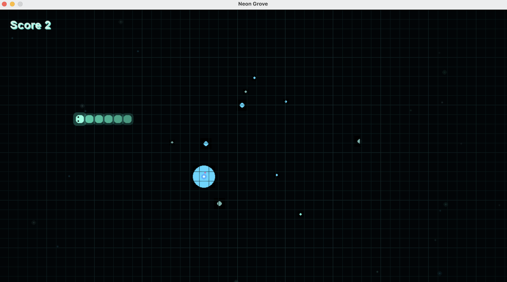

# Neon Grove

Neon Grove is a bioluminescent reimagining of classic Snake built with Python and Pygame.



## Phase 1

This first pass focuses on a stable, playable foundation:

- grid-based snake movement
- WASD and arrow-key controls
- food spawning and growth
- score tracking
- collision and game-over states
- restart support
- lightweight neon forest rendering

## Requirements

- Python 3.12 or newer
- Git

## Installation

Clone the repository:

git clone git@github.com:tabmorris/neon-grove.git
cd neon-grove

## Running the Project

### macOS/Linux

```bash
python3 -m venv .venv
.venv/bin/python -m pip install -r requirements.txt
.venv/bin/python main.py
```

### Windows (Command Prompt)

```cmd
python -m venv .venv
.venv\Scripts\python.exe -m pip install -r requirements.txt
.venv\Scripts\python.exe main.py
```

### Windows (PowerShell)

```powershell
python -m venv .venv
.\.venv\Scripts\python.exe -m pip install -r requirements.txt
.\.venv\Scripts\python.exe main.py
```

## Controls

- Arrow keys or WASD: move
- Space or Enter: start / restart
- P or Escape: pause / resume during play
- Escape: quit

## Architecture

- `main.py`: Pygame setup and the application loop.
- `game/game_state.py`: gameplay rules, timing, scoring, and state transitions.
- `game/snake.py`: snake body, movement, growth, and collision helpers.
- `game/food.py`: food placement that avoids the snake.
- `game/input_handler.py`: keyboard input mapped into gameplay actions.
- `game/renderer.py`: visual presentation and UI overlays.
- `utils/colors.py`: shared palette values.
